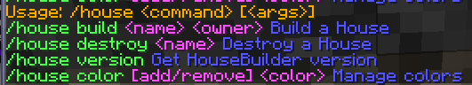

Getting Started
===============

MondoCommand is a library for Bukkit applications which lets you create a command which dispatches a number of sub-commands along with generating pretty-looking help pages, checking arguments, and so on.

It also abstracts out a lot of the annoying things about doing subcommands, like return values, argument handling, and so on to help you write shorter, cleaner code (and split it up nicely too).

Basic usage
-----------

Do this in your onEnable or something similar:

.. code-block:: java

	// Basic setup and registration
	MondoCommand base = new MondoCommand();
	base.autoRegisterFrom(this);
	getCommand("housebuilder").setExecutor(base);

Now you can add some handlers:

.. code-block:: java

	@Sub(description="Build a House", minArgs=2, usage="<owner> <name>")
	public void build(CallInfo call) {
	    String owner = call.getArg(0);
	    String name = call.getArg(1);
	    if (houseMap.containsKey(name)) {
	        call.reply("House with name %s already exists", name);
	    } else {
	        // TODO add code to actually make a house
	        call.reply("House %s made!", name);
	    }
	}

	@Sub(description="Destroy a House", permission="housebuilder.destroy",
	     minArgs=1, usage="<name>", allowConsole=false)
	public void destroy(CallInfo Call) {
	    // We don't need to check number of args, because we registered the
	    // command with minArgs = 1.
	    String name = call.getArg(0);
	    if (houseMap.containsKey(name)) {
	        houseMap.remove(name);
	        call.reply("{GREEN}House {GOLD}%s{GREEN} removed", name);
	    } else {
	        call.reply("{RED}House %s not found", name);
	    }
	}

This creates an output which looks like this:

Things you can do with CallInfo
~~~~~~~~~~~~~~~~~~~~~~~~~~~~~~~

All MondoCommand handlers take a single argument of type CallInfo which contains all the information you'd normally get from a command handler, plus a bunch of added bits to make writing commands much more convenient:

* :meth:`call.getPlayer() <mondocommand.CallInfo.getPlayer()>` gets a Player object (no more casting from CommandSender) and commands can be registered as allowing console or player-only.
* :meth:`call.reply(template, [...]) <mondocommand.CallInfo.reply(java.lang.String, java.lang.Object...)>` This is the gem of MondoCommand, it will send a message back to the user that interprets color codes embedded in the string, and lets you also interpolate variables into the string without having to do string concatenation. See below for how to use call.reply.
* :meth:`call.getArg(index) <mondocommand.CallInfo.getArg(int)>` To get a single argument, where the 0th index is the first index which comes after the sub command name (no more argument math!) and furthermore, you don't need to check the length of the args if you registered the subcommand with [B]setMinArgs()[/B], it will show the player a usage message and stop them from running your command.
* :meth:`call.getIntArg(index) <mondocommand.CallInfo.getIntArg(int)>` - Convenient way to get an argument coerced into an integer.
* :ref:`call.getJoinedArgsAfter(index) <mondocommand.CallInfo.getJoinedArgsAfter(int)>` - If you need to get a bunch of arguments after a certain index (like say you're accepting a text entry or chat message) this convenience method does that for you.
* :ref:`call.numArgs() <mondocommand.CallInfo.numArgs()>` - Get the number of arguments.
